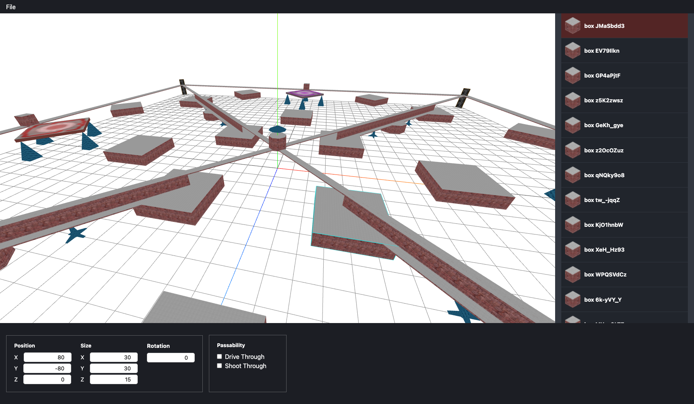

# Web BZEdit

A map editor for BZFlag powered by your every day browser heavily inspired by [The Noah's webbzw](https://github.com/BZFlagCommunity/webbzw) and [cs8425's bzw-viewer](https://github.com/cs8425/bzw-viewer).



## About the Project

The goal of Web BZEdit is serve as a replacement for all other (dated and semi-broken) desktop based map editors. It's an incredibly ambitious project and will not be finished any time soon; there's a lot of work that needs to be done.

### Why not continue an existing project?

I can honestly say, I tried. Existing map editors were dated, hard to build, or hard to jump into as a newcomer.

### Is this an official BZFlag project?

No. I've discussed this with the rest of the BZFlag team, and it didn't quite line up with the goals of the project. Mainly due to limited resources, it was decided that attention and efforts are better spent on improving the map system for the future of the game.

### Is this project ready for daily use?

No.

### When will it be ready for daily use?

:man_shrugging:

### If this project isn't ready for daily use, why make it public?

Because I want to build this in the open and want to see if it grabs the attention of anyone that can help with this project.

### I found a bug, how should I report it?

Please don't report bugs at the moment. This project is under heavy development and is not intended for daily use; there are a lot of bugs and incomplete features. I know.

Once I can consider this project to be ready for daily use, then I'll highly encourage reporting bugs!

### I have an idea that I think you should totally implement, how can I tell you about it?

Please don't. The roadmap for this project exists in my head right now. There's _a lot_ that I need to plan out and write. I don't want to waste time hearing your idea and simply responding, "I know."

Once this project is stable, I'll gladly take feature requests.

### How can I help?

This is going to be an incredibly large project that has a lot of moving parts. Here's what I need help with:

- If you're a developer, this is a standard React project and will gladly welcome more React devs to join in helping build this.
- If you're a UI/UX designer, I need help in the design of the application and making it user-friendly.
- If you have experience with Electron, I need help with porting this application to work within Electron in addition to the web.
- If you have money to spend, sponsor the developers working on this project :smile:

## Development

This is a standard React project that has no special dependencies. This project uses Yarn, but you can use npm as well. These commands will download all dependencies and then start a local web server with the map editor that automatically loads the HiX map.

```bash
yarn install
yarn start
```

## License

[MIT](./LICENSE)
