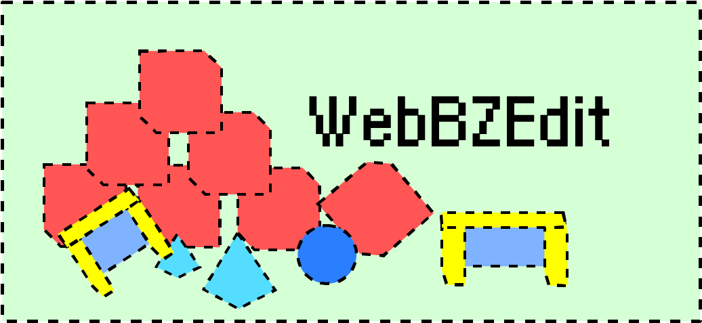
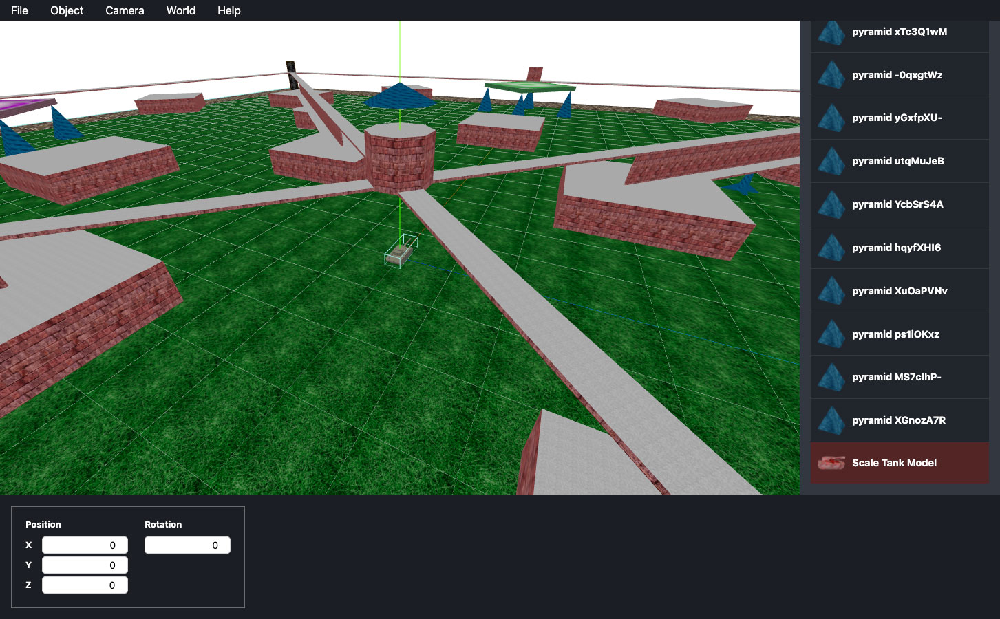

<p align="center"><a href="https://web-bzedit.allejo.org/" target="_blank">
    
</a></p>

<p align="center">
    <a href="https://github.com/allejo/WebBZEdit/releases/latest">
        
    </a>
    <a href="https://github.com/allejo/WebBZEdit/blob/master/LICENSE">
        
    </a>
</p>

A map editor for BZFlag powered by your every day browser heavily inspired by [The Noah's webbzw](https://github.com/BZFlagCommunity/webbzw), [cs8425's bzw-viewer](https://github.com/cs8425/bzw-viewer), and [iBZEdit](https://sourceforge.net/projects/ibzedit/).



## About the Project

The goal of Web BZEdit is serve as a beginner-friendly replacement for all other (dated and semi-broken) desktop based map editors. It's an incredibly ambitious project and will not be finished any time soon; there's a lot of work that needs to be done.

### Why not continue an existing project?

I can honestly say, I tried. Existing map editors were dated, hard to build, or hard to jump into as a newcomer.

### Is this an official BZFlag project?

No. I've discussed this with the rest of the BZFlag team, and it didn't quite line up with the goals of the project. Mainly due to limited resources, it was decided that attention and efforts are better spent on improving the map system for the future of the game.

### Is this project ready for daily use?

Sorta? There is no support for editing any advanced objects like spheres, groups, and meshes. Support for this will come but I don't know when.

### I found a bug, how should I report it?

Yes! Please open an issue on [GitHub](https://github.com/allejo/WebBZEdit/issues) or in [this BZFlag forums thread](https://forums.bzflag.org/viewtopic.php?t=20647).

### I have an idea that I think you should totally implement, how can I tell you about it?

Same as above, open an issue or post in the forums. I make no guarantees that I'll implement your idea though. Sorry, I just don't have the time.

### How can I help?

This is going to be an incredibly large project that has a lot of moving parts. Here's what I need help with:

- If you're a developer, this is a standard React project and will gladly welcome more React devs to join in helping build this.
- If you're a UI/UX designer, I need help in the design of the application and making it user-friendly.
- If you have experience with Electron, I need help with porting this application to work within Electron in addition to the web.
- If you have money to spend, sponsor the developers working on this project :smile:

## Development

This is a standard React project that has no special dependencies. This project uses Yarn, but you can use npm as well. These commands will download all dependencies and then start a local web server with the map editor that automatically loads the HiX map.

```bash
npm install
npm start
```

## License

[MIT](./LICENSE)
